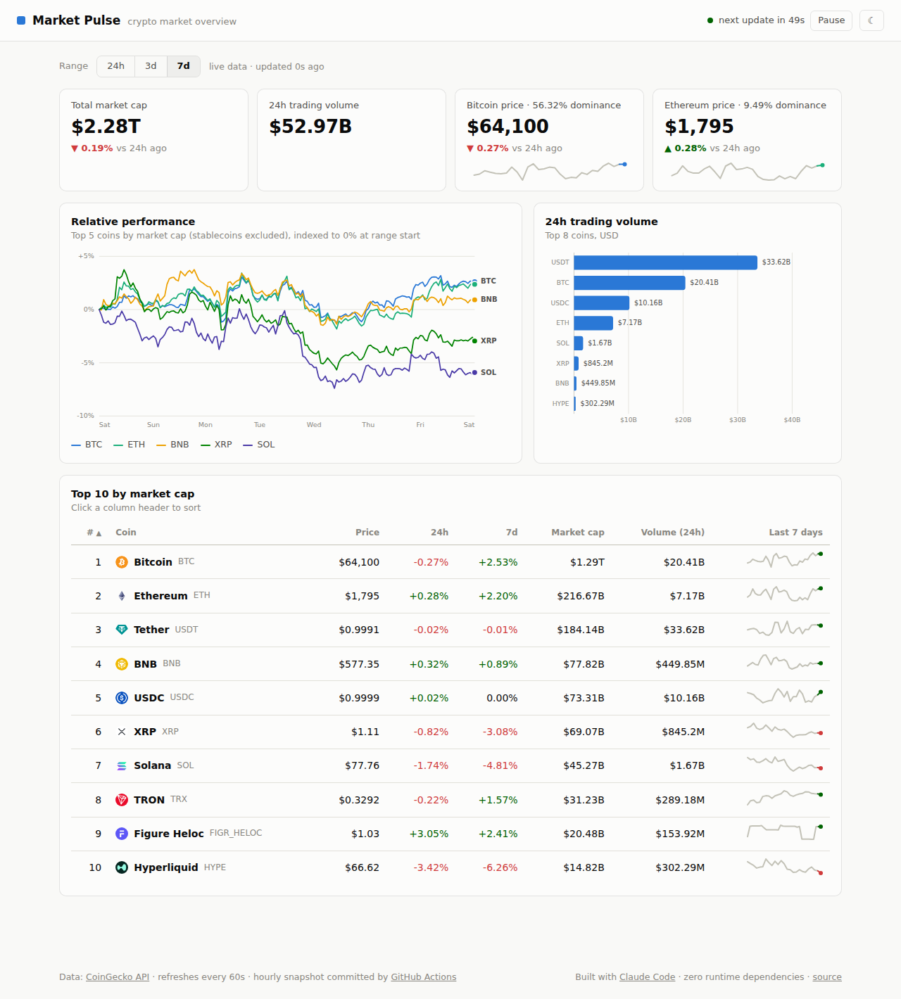
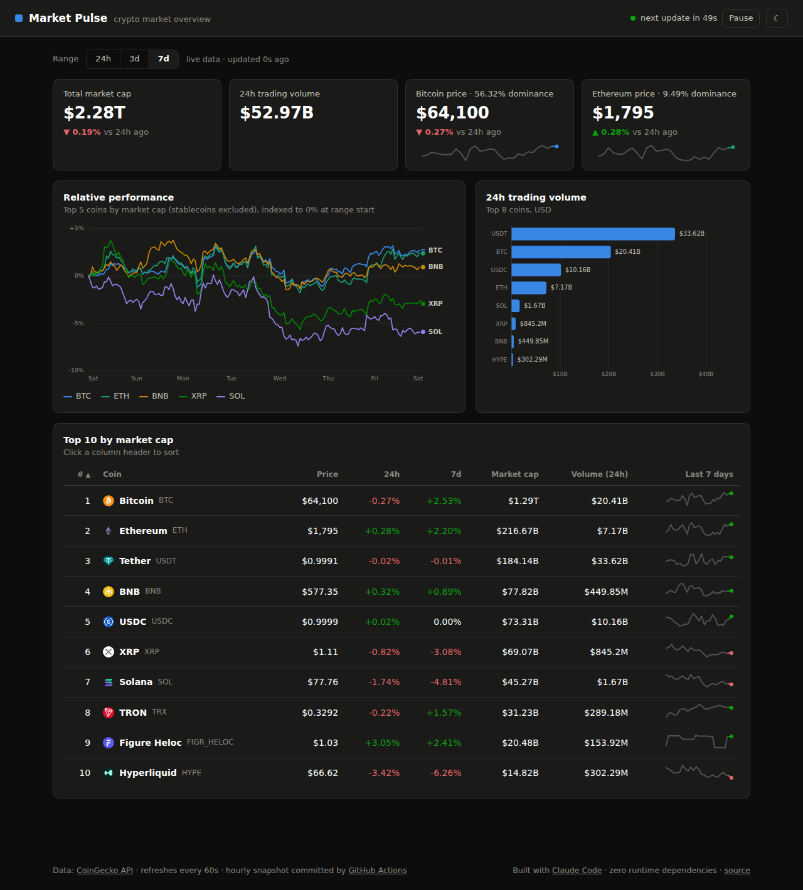

# Market Pulse 📈

**Live crypto market dashboard — zero dependencies, self-updating, and fully automated.**

[](https://github.com/mooceanstudio/market-pulse/actions/workflows/update-data.yml)
[](https://github.com/mooceanstudio/market-pulse/actions/workflows/deploy-pages.yml)
[](LICENSE)

**Live demo → https://mooceanstudio.github.io/market-pulse/**



## What it does

- **Pulls data from two APIs** — [CoinGecko](https://www.coingecko.com/en/api) (top-10 market data, 7-day hourly price history, global stats) and [alternative.me](https://alternative.me/crypto/fear-and-greed-index/) (Fear & Greed index) — and **auto-refreshes every 60 seconds** with a visible countdown and pause control.
- **Visualizes it** with hand-rolled SVG (no chart library, no framework, no build step):
  - stat tiles with 24h deltas and sparklines, plus a status-colored Fear & Greed meter
  - a multi-series indexed performance chart with crosshair + all-series tooltip
  - a 24h volume bar chart with per-bar tooltips
  - a sortable top-10 market table with 7-day trend sparklines
  - a time-range filter (24h / 3d / 7d) that re-scopes the charts
  - full light/dark theming (OS preference + manual toggle)
- **Automates updates** two ways:
  - a GitHub Action commits an hourly data snapshot (`data/snapshot.json`), so the dashboard degrades gracefully to cached data when the live API is rate-limited or unreachable — the UI tells you which source you're seeing
  - every push (including the bot's snapshot commits) auto-deploys to GitHub Pages

## Highlights

- **Zero dependencies** — plain ES modules + hand-rolled SVG, no framework or build step.
- **Self-healing data** — an hourly GitHub Action commits a snapshot so the dashboard falls back to cached data when the live API is rate-limited or unreachable.
- **Accessible design system** — a colorblind-validated categorical palette (checked in both themes), one hue per measure, no dual axes, and tooltips built with `textContent` against untrusted API strings.
- **One-way data flow** — `fetchData() -> state.data -> renderAll()`; see [`PROJECT.md`](PROJECT.md) for architecture and design rules.

## Architecture

```
Browser ──60s──▶ CoinGecko + alternative.me ──fail?──▶ data/snapshot.json (fallback)
                                              ▲
GitHub Actions (hourly cron) ── fetch-snapshot.mjs ── commit ──▶ Pages deploy
```

```
index.html                 static shell — one card per widget
css/style.css              all design tokens, light + dark
js/
  config.js                endpoints, cadence, palette slots
  api.js                   live fetch → snapshot fallback
  charts.js                SVG line/bar/sparkline renderers + tooltip layer
  table.js                 sortable market table
  app.js                   state, refresh loop, theme, renderAll()
scripts/fetch-snapshot.mjs snapshot fetcher (run by the hourly Action)
```

## Run locally

No install, no build:

```bash
git clone https://github.com/mooceanstudio/market-pulse.git
cd market-pulse
python3 -m http.server 8080   # any static server works
# open http://localhost:8080
```

Refresh the fallback snapshot: `node scripts/fetch-snapshot.mjs`

## Design notes

- **Indexed, not dual-axis.** Comparing BTC ($64k) with XRP ($1) on one chart is done by indexing every series to 0% at range start — never with a second y-axis.
- **Stablecoins are excluded from the performance chart** (they're flat by definition) but kept in the volume chart and table, where they matter.
- **Accessible by construction.** The categorical palette is validated for color-vision deficiency in both themes; every chart value is also reachable without hover (direct labels, axis ticks, or the table).
- **Refetch keeps the frame.** While new data loads, the previous render dims instead of flashing a skeleton.

<details>
<summary>Dark mode screenshot</summary>



</details>

## License

[MIT](LICENSE)
